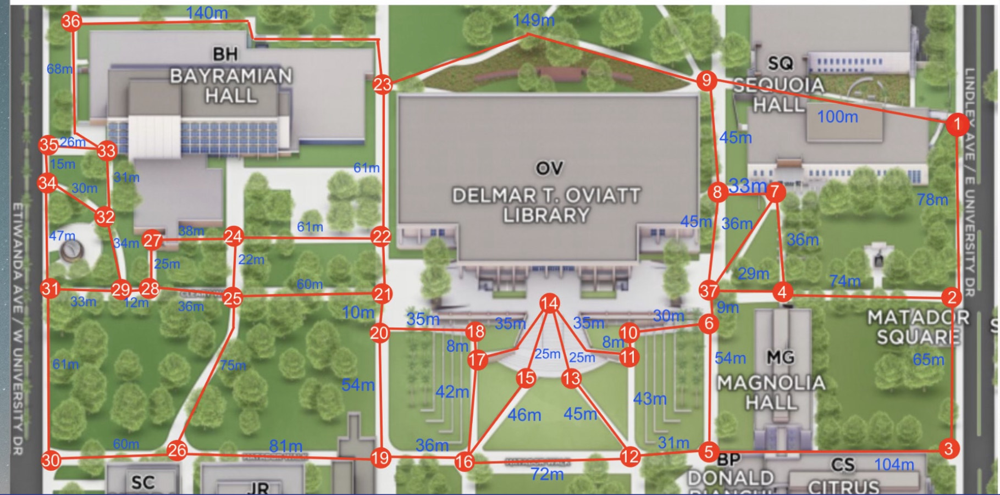

# csun-pathfinder-automation

## Overview
This project focuses on utilizing Kruskal’s Minimum Spanning Tree Algorithm to map the walkways at California State University, Northridge (CSUN). The objective is to achieve optimal path connectivity for a line follower robot, enhancing campus operations through task automation.

### Files
- `kruskals.java`: Java source code for Kruskal's algorithm.
- `prims.java`: Java source code for Prim's algorithm.
- `kruskalsOutput.pdf`: Output results of Kruskal's algorithm run.
- `primsOutput.pdf`: Output results of Prim's algorithm run .
- `csun-robot-presentation.pptx`: PowerPoint presentation summarizing the project.

## Data Set Image

## Usage
1. Open `kruskals.java` and `prims.java` for algorithm implementations.
2. Review the output files for the results of Kruskal's and Prim's algorithms.
3. Explore the PowerPoint presentation (`csun-robot-presentation.pptx`) for an overview of the project.

## Contributors

**Mishek Sambahangphe:**
- Data set collection
- Adapting source code
- Google Maps and graphics (spanning tree)
- Zoom presentations

**Cesar Gonzalez:**
- Data set collection
- PowerPoint presentation
- Library and online research
- Zoom presentations

## Notes
- The project aimed to compare the efficiency of Kruskal's and Prim's MST algorithms using a specific data set.
- The results of both algorithms are provided in the respective output files.